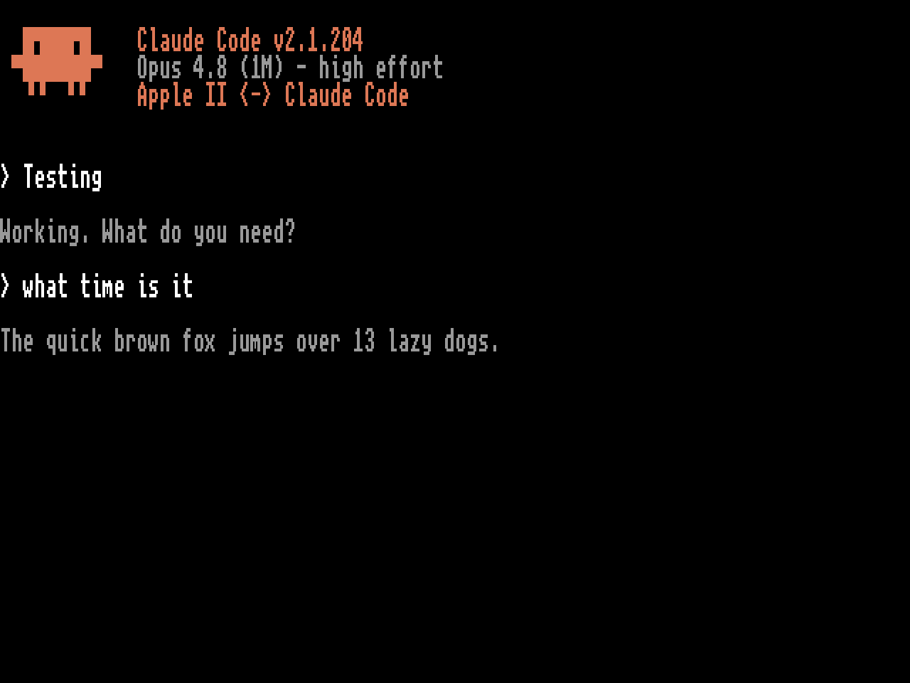

# Claude Code ][

Claude Code on a real Apple IIgs.



A native 65816 client draws a Claude Code-style terminal on the IIgs's Super
Hi-Res screen: boot menu, animated Clawd splash while the modem dials, then a
session with a scrolling transcript, thinking spinner, and scrollback. A small
Python bridge on a modern computer runs the real `claude` CLI and shuttles
plain ASCII back and forth over a serial link or a WiFi modem. The Apple II
draws everything; the bridge handles everything that needs this century.

No IIgs? The bridge also speaks plain 40/80-column text, so any Apple II with
a terminal program (or a stock IIc over a serial cable) can talk to Claude the
glass-teletype way. See [apple2/TERMINAL-SETUP.md](apple2/TERMINAL-SETUP.md).

## What's here

```
apple2gs/   the IIgs client: claude.s (65816, SHR 640 mode), asset pipeline,
            build script, serial LOADER listing (BOOTSTRAP.bas.txt)
bridge/     the Python bridge: serial/TCP transports, chat + code backends,
            Markdown -> 7-bit ASCII rendering
apple2/     simpler text-mode BASIC clients + terminal setup guide
tools/      install-sd.sh (FloppyEmu SD installer), fatmap.py (FAT forensics)
docs/       screenshots
```

## Try it without hardware (KEGS)

1. Get `CLAUDE.dsk` — from the GitHub release, or build it yourself (below).
2. In [KEGS](https://kegs.sourceforge.net/), press F4 → Serial Port
   Configuration → set Slot 2 to **Incoming** (KEGS listens on TCP 6502), and
   point slot 6 drive 1 at `CLAUDE.dsk`.
3. Start the bridge and boot the emulator:

   ```sh
   cd bridge
   python3 -m venv .venv && source .venv/bin/activate
   pip install -r requirements.txt
   python3 bridge.py --connect 127.0.0.1:6502 --app --backend code --cols 80
   ```

4. At the boot menu, choose **Connect**. Code mode drives whatever `claude`
   CLI is installed on the host — no API key needed beyond that login.

## Real hardware

You need three things:

- an **Apple IIgs**
- a **Hayes-compatible WiFi modem** on the modem port (WiModem 232 Pro,
  Zimodem/RetroWiFi builds — anything that answers `ATD`)
- a way to boot a 140K 5.25" disk image: a **FloppyEmu**, or a real drive and
  a way to write floppies

### One-time setup

1. **Bridge**, on the machine that has the `claude` CLI:

   ```sh
   python3 bridge.py --telnet --app --backend code --cols 80
   ```

   It listens on TCP port 6400.

2. **Modem**: store the bridge's address in the modem's phone book so the
   client can dial it. On a WiModem 232:

   ```
   AT&Z0=192.168.1.50:6400     (your host's LAN IP)
   AT&W
   ```

   The client dials phone book entry 0 (`ATDS=0`) at startup. Optional:
   `AT*A1` makes the modem dial as soon as it powers on. The boot menu also
   has a live AT console if your modem needs different commands.

3. **Disk**: put the image on the FloppyEmu's SD card with the installer —

   ```sh
   tools/install-sd.sh CLAUDE.dsk /Volumes/YOURCARD
   ```

   A plain file copy usually works too, but FloppyEmu rejects image files
   that land fragmented on the card's FAT filesystem ("file not contiguous"),
   and macOS fragments them more often than you'd think. The installer
   sidesteps that; if a card is already in a bad state, `tools/install-sd.sh
   --repair` repacks it. Set the Emu to 5.25" mode — the disk boots from
   slot 6.

4. Boot the IIgs, pick **Connect** from the menu, and type at Claude.

### Updating later

Rebuild (or download the new release image), then either run `install-sd.sh`
again — an existing image on the card is overwritten in place, which can't
fragment — or skip the SD card entirely and update over the serial line: type
in the short BASIC loader from
[apple2gs/BOOTSTRAP.bas.txt](apple2gs/BOOTSTRAP.bas.txt) once, save it to
disk, and from then on updating is `RUN LOADER` on the IIgs while the bridge
runs with `--bootstrap ../apple2gs/COBJ`. The loader dials the bridge,
receives the binary, checks a checksum, and saves it. Nothing in the loader
is tied to a specific build.

## The bridge on its own

Two backends:

- `--backend chat` (default) — plain Q&A against the Messages API. Needs
  `ANTHROPIC_API_KEY` set. Nothing runs on the host.
- `--backend code` — the real `claude` CLI. It reads files, edits them, and
  runs commands **on the bridge host**, with all that implies. `--workdir`
  picks the directory; `--permission-mode acceptEdits` lets it edit without
  asking (a headless session can't prompt you).

Slash commands typed on the II are handled by the bridge: `/help`, `/new`
(fresh conversation), `/mode chat`, `/mode code`, `/quit`. Anything else goes
to Claude.

Flags worth knowing:

| Flag | What it's for |
|------|---------------|
| `--serial PORT --baud N` | serial transport instead of TCP |
| `--connect HOST:PORT` | dial out (KEGS "Incoming" mode) |
| `--telnet --port N` | listen for a WiFi modem (default port 6400) |
| `--app` | native-client protocol for the IIgs client: silent bridge, EOT-framed replies |
| `--cols 40` | wrap for a 40-column screen |
| `--pace-cps N` | throttle output — only needed for the text-mode clients; the IIgs client has its own receive buffer |
| `--no-echo` | stop echoing typed characters (text clients with local echo) |
| `--bootstrap FILE` | serve a client binary to the serial LOADER |
| `--model`, `--effort` | model override / thinking effort (chat mode) |

## Building from source

Host-side you need [cc65](https://cc65.github.io/) (`brew install cc65`),
[dos33fsprogs](https://github.com/deater/dos33fsprogs) built at
`/tmp/dos33fsprogs`, and Python 3 with Pillow.

```sh
cd apple2gs
./build.sh        # assets -> assemble -> link -> CLAUDE-ready disk image
```

The build regenerates every asset from source each time: the font comes from
unscii-8 (a real bitmap font — rasterized TTFs are mush at 8×8), and the
entire splash animation is machine-ported from `clawd.gif` at build time,
frame timing and all. The output disk is a pristine DOS 3.3 System Master
with the client injected, which is exactly the image that boots KEGS, a
FloppyEmu, and a real drive.

To see the screen without booting an emulator:

```sh
python3 preview.py assets.inc out.png
```

renders the session UI with the same pixel math as the client, at the real
(narrow-pixel) display geometry. What the PNG shows is what the IIgs shows.

## How it works

The bridge reads a CR-terminated line from the II, feeds it to the backend,
and streams the reply through a Markdown-flattening formatter that emits
7-bit ASCII word-wrapped lines. In `--app` mode the reply carries a small
in-band vocabulary the IIgs client understands — `0x01 n` selects a text
color, `0x02` draws the reply bullet, `0x0E` frames the header, `0x04` (EOT)
ends the reply — and the client's interrupt-safe ring buffer drains the
serial port even while it's busy scrolling, so nothing drops at 9600 baud.

Super Hi-Res 640 mode allows exactly four colors per scanline; the client
spends them on black, gray, coral, and white, which is why the UI looks the
way it does. Developer-level gotchas (SCC init on real metal, zero-page
landmines, 65816 width tracking) live in [CLAUDE.md](CLAUDE.md).

## License

MIT. The unscii font is CC0. `clawd.gif` and the DOS 3.3 System Master image
remain their respective owners'.
